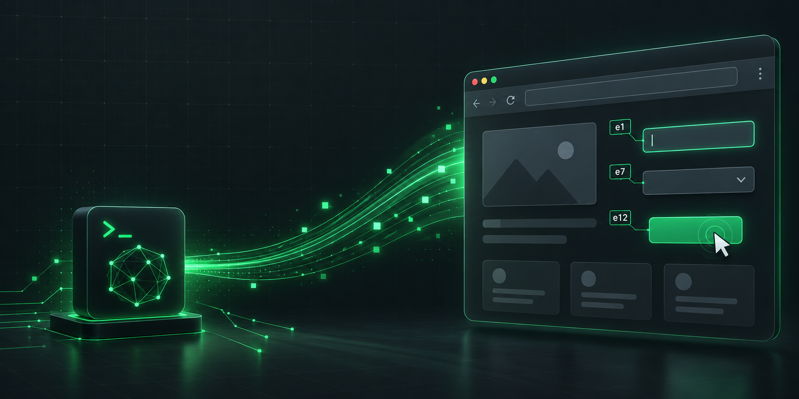

<p align="center">
  
</p>

<h1 align="center">
   ClawBrowse
</h1>

<p align="center"><strong>Let Claude Code drive your real, logged-in Chrome — open source, no keys, no second model.</strong></p>

<p align="center">
<a href="LICENSE"></a>
<a href="CONTRIBUTING.md"></a>
<a href="package.json">=18"></a>

<a href="https://claude.com/claude-code"></a>
<a href="https://modelcontextprotocol.io"></a>
</p>

ClawBrowse is a **Chrome MV3 extension + a tiny zero-dependency MCP server** that lets your local
AI coding agent (like **Claude Code**) read and act on your **actual, logged-in browser tabs** —
your profile, your sessions, your open pages — with **no remote-debug port, no browser relaunch,
and no separate AI model or API key.**

It's the open, self-owned answer to "I wish my agent could just use my real browser": the same
capability as the first-party Claude-in-Chrome extension, but **yours, auditable, MCP-native, and
faster per action** (see the [benchmark](#benchmark) below).

```
Claude Code ──stdio (MCP)──▶ mcp/server.mjs ──ws://127.0.0.1:10577──▶ Chrome extension ──CDP──▶ your real tabs
```

---

## Getting started

ClawBrowse has two small parts that work together: the **Chrome extension** (the hands + eyes in
your browser) and a **local server** that your AI agent runs and talks to. You install the
extension once, add the server to your agent with one line, and you're set.

### Easy install (recommended)

1. **Install the extension** from the Chrome Web Store: **ClawBrowse** — *🚧 in review; the link
   will go here once it's live. Until then, use "From source" below.*
2. **Add the server to Claude Code** — one line, nothing to clone:
   ```bash
   claude mcp add --scope user clawbrowse -- npx -y clawbrowse@latest
   ```
3. **Restart Claude Code.** That's it — ask it *"use clawbrowse: what's my browser status?"* and
   you should see `extension_connected: true`. (The extension badge turns **green ●** when connected.)

> Needs **Node.js ≥ 18** installed (for the one-line server) and **Claude Code** (or any MCP client).

### From source (for contributors, or before the store listing is live)

```bash
git clone https://github.com/ItaiZeilig/clawbrowse.git
```
1. **Load the extension:** `chrome://extensions` → **Developer mode** (top-right) → **Load
   unpacked** → pick the `clawbrowse/extension` folder.
2. **Register the server** with the full path to your clone:
   ```bash
   claude mcp add --scope user clawbrowse -- node /full/path/to/clawbrowse/mcp/server.mjs
   ```
3. **Fully restart Claude Code** (not just `/mcp`), then run the status check above.

## Using it

You don't call the tools yourself — you just **ask Claude Code in plain language**, and it uses
ClawBrowse to drive whatever tab you point it at. Some things to try:

- *"Open news.ycombinator.com and give me the top 5 story titles."*
- *"On this tab, search for 'open source license' and open the first result."*
- *"Fill the signup form on the current page with my name and email, but don't submit."*
- *"Go to my GitHub notifications and tell me what's new."*

Tips:
- It acts on the **tab you have open and are logged into** — no separate window, no re-login.
- Point it at a specific tab by name, or it uses the active tab.
- It reads the page as a list of controls and clicks/types precisely — no screenshots needed.

## Troubleshooting

| Symptom | Fix |
| --- | --- |
| Badge never turns green | The server isn't running — make sure you **fully restarted** Claude Code after `claude mcp add` (a `/mcp` reconnect alone won't relaunch it). |
| "No extension connected" | Reload the extension at `chrome://extensions`, then re-run `browser_status`. |
| "Another debugger is already attached" | That tab has DevTools open or another extension driving it — close DevTools or switch tabs. |
| A `chrome://` / Web Store page won't drive | Those are browser pages Chrome blocks from automation — use a normal web page. |
| Changed the port | Set the same port in the extension's **Options** and in `--env CLAWBROWSE_PORT=…`. |

> Requires **Node ≥ 18** (≥ 22 to run the test suite). Works on Chrome, Edge, and Brave.

---

## Highlights

- **Your real browser.** Uses Chrome's built-in `chrome.debugger` (CDP) on tabs you already have
  open and logged into — no `--remote-debugging-port`, no relaunch, no separate profile.
- **The agent is the policy.** No second model, no `TYPESAFE_API_KEY`, no OpenRouter — *you*
  (Claude) decide every action. Page content flows to your agent as normal tool results and
  **never leaves for any third-party server.**
- **Reads pages as an element table, not screenshots.** A compact, numbered list of the actionable
  controls in view — cheap in tokens, fast to reason over, precise to act on.
- **Fast.** Stable element refs let it act in one round trip — **~2.2× faster per action** than the
  closed alternative in testing.
- **Zero dependencies, MIT, extensible.** The whole server is one auditable `.mjs` file; the
  extension is plain JS. Add a tool or an op in minutes.

## Benchmark

Because ClawBrowse keeps **stable element refs** and its `navigate`/`act` already return the fresh
table, the agent clicks a known target in **one** round trip. Screenshot/accessibility-tree drivers
do **perceive-then-act** — a read (or screenshot) *then* a click — paying an extra agent round trip
and a larger payload every action.

Measured task: click 5 different section links on the same Wikipedia page, averaged, same machine,
same agent (Claude):

| | ClawBrowse | Claude-in-Chrome |
| --- | --- | --- |
| Calls per click | **1** (`act` by stable ref) | 2 (`read_page` → click) |
| Avg wall-clock per click | **~7.6 s** | ~17.0 s |
| Perception payload | compact, viewport-only | full a11y tree w/ URLs (up to 50 KB) |

> **Honest caveat:** with Claude as the shared brain, absolute wall-clock is dominated by agent
> latency and is noisy — treat the **~2.2× ratio** as the signal, not the exact seconds. The win is
> *structural* (fewer round trips + smaller payloads), which also means fewer tokens per step. It's
> **not** the sub-second speed of a small, dedicated click-picking model — ClawBrowse trades that
> raw speed for a smart, general brain (Claude) with no keys and no per-click cost.

## How it compares

| | Claude-in-Chrome | **ClawBrowse** |
| --- | --- | --- |
| Drives your real, logged-in Chrome | ✅ | ✅ (`chrome.debugger`, no port) |
| Decision model | Claude | **Claude — no second model, no key** |
| Perception | screenshots + a11y tree | **compact element table** |
| Round trips per action | 2 (perceive → act) | **1** (stable refs) |
| Page data to a third party | no | **no** |
| Per-site permission gate | yes (allowlist) | no |
| Open source / self-owned | ❌ | **✅ MIT, zero-dep** |
| Works with any MCP client | ❌ | **✅** |

## The element table

Every observation returns a compact, numbered table of the **in-viewport, actionable** controls —
with proper accessible names, current values, and state flags — instead of a screenshot:

```
Web browser - Wikipedia  —  https://en.wikipedia.org/wiki/Web_browser
scroll 0/6361  ·  83 controls
e2   fill    "Search Wikipedia"
e6   click   "Log in"
e10  click   "2 History"
e13  click ▾ "Toggle Browser market subsection"
e9   click✓  "Remember me"
e3   select  "Country"  opts{US | UK | ...}
```

Flags after the kind: `✓`/`·` checked/unchecked · `▾`/`▸` expanded/collapsed (open vs closed menu,
combobox, accordion) · `◉` selected (active tab/option). Refs like `e10` derive from a **stable node
identity**, so the agent can act on a control by ref in **one round trip**.

## Tools

| Tool | Purpose |
| --- | --- |
| `browser_status` | Connection + attached-tab diagnostics. Call first if anything's off. |
| `browser_tabs` | List open tabs (`id`, `title`, `url`, `active`). |
| `browser_navigate` | `{ url, tabId? }` → element table after load. |
| `browser_observe` | `{ tabId? }` → the element table. |
| `browser_read` | `{ tabId?, max_chars? }` → the page's readable prose (articles, docs, rules). |
| `browser_act` | `{ ops: [...], tabId? }` → runs ops in order, returns a fresh table + a "page changed?" signal. |
| `browser_assert` | `{ contains? \| url_includes? \| ref_visible?, tabId? }` → prove an outcome (pass/fail). |

**Ops for `browser_act`:** `{op:"click",ref:"e12"}` · `{op:"click_text",text:"..."}` (for custom
widgets/menus not in the table) · `{op:"type",ref:"e7",text:"..."}` · `{op:"select",ref:"e8",value:"..."}`
· `{op:"key",key:"Enter"}` · `{op:"scroll",dy:600}` · `{op:"wait",ms:500}`.

## Reliability & safety engineering

ClawBrowse was hardened through two multi-agent code audits **and** live testing on real sites:

- **Hit-tested clicks.** Before every click it re-resolves the element live and verifies the center
  isn't covered (`elementFromPoint`), so it never clicks a stale, moved, or occluded target.
- **Semantic freshness guard.** An element's role + accessible name is fingerprinted at observe time
  and re-checked before acting — a silently relabeled target is rejected ("observe again") instead
  of mis-clicked.
- **Robust fill.** Select-all + `insertText`, which works with React/controlled inputs; typed
  comboboxes wait for their autocomplete options to actually render.
- **Background-tab safe.** Uses `Emulation.setFocusEmulationEnabled` and `setTimeout`-based waits
  (never `requestAnimationFrame`, which Chrome pauses in background tabs) so driving a tab you aren't
  looking at doesn't hang.
- **No double-execution.** If a post-action read fails because the page is navigating, the ops are
  reported as executed ("call observe next") rather than surfaced as a failure to retry.
- **Serialized, unwedgeable command queue** — overlapping calls can't race the debugger, and one
  hung command can't block the rest.

## Security & privacy

- **No data leaves your machine.** There's no model and no API key; page content goes only to the
  agent you run locally. `password`, `file`, and `hidden` inputs are excluded and never exposed.
- **Local-only bridge.** The WebSocket binds to `127.0.0.1`, rejects non-`chrome-extension://`
  origins (so a web page can't connect), trusts only the current extension socket, and caps inbound
  frame size.
- **One powerful permission, no host permissions.** The extension declares `debugger` (plus `tabs`,
  `storage`, `alarms`) and **no** host permissions — `chrome.debugger` doesn't need them. That's the
  same capability class as any real-browser agent; use it deliberately.
- **Fully auditable.** The server is one zero-dependency file; the extension is plain JS.

Found a vulnerability? See **[SECURITY.md](SECURITY.md)** — please don't open a public issue.

## Notes & limits

- Attaching shows Chrome's "ClawBrowse is debugging this browser" banner — expected.
- One debugger client per tab: a tab with DevTools open (or driven by another extension) can't be
  attached — switch tabs or close DevTools.
- `chrome://`, the Chrome Web Store, and other browser pages can't be driven.
- No cross-origin iframe traversal, canvas, or file uploads yet.

## Contributing

Contributions welcome — see **[CONTRIBUTING.md](CONTRIBUTING.md)** for dev setup, tests (`npm test`),
and the PR process. By participating you agree to the **[Code of Conduct](CODE_OF_CONDUCT.md)**.
Questions? **[SUPPORT.md](SUPPORT.md)**.

## Credits

Built with [Claude Code](https://claude.com/claude-code). Some of the page-perception and
action-execution techniques are adapted from
[browser-use/jev-ultrafast](https://github.com/browser-use/jev-ultrafast) (MIT); this credit is kept
as required by that project's license.

## License

[MIT](LICENSE) © ClawBrowse contributors.
